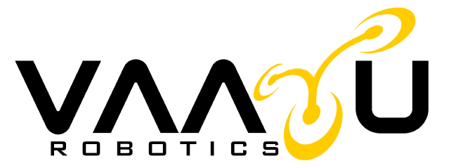

# Vaayu Robotics - Advanced Drone Solutions



## 🚁 About Vaayu Robotics

**Vaayu Robotics** is a cutting-edge drone technology company that pioneers the future of aerial data collection and analysis. We combine advanced drone technology with sophisticated analytics to deliver actionable insights across various industries. Our mission is to transform how businesses collect, analyze, and utilize aerial data through precision, innovation, and excellence.

### 🎯 Our Vision
To be the leading provider of drone technology solutions, setting new standards for safety, innovation, and excellence in the industry.

### 🎯 Our Mission
To provide cutting-edge drone solutions that transform how businesses collect, analyze, and utilize aerial data.

### 🎯 Our Values
Safety, quality, innovation, and client satisfaction are at the core of everything we do.

## 🌟 Key Features

### ✨ Interactive User Experience
- **Animated Loading Screen**: Custom GSAP-powered loader with logo animation
- **Magnetic Navigation**: Interactive magnet effect on navigation elements
- **Smooth Animations**: GSAP-powered transitions and scroll-triggered animations
- **Responsive Design**: Fully responsive across all device sizes
- **Video Integration**: Interactive video cards that play on hover

### 📱 Modern UI Components
- **Image Carousel**: Swiper.js-powered image slider with fade effects
- **Service Cards**: Interactive cards with 3D tilt effects and video previews
- **Counter Animation**: Animated counters showing company achievements
- **Contact Form**: Professional contact form with validation
- **Mobile Navigation**: Hamburger menu with smooth overlay transitions

## 🛠️ Technology Stack

### Frontend Framework
- **React 19.1.1** - Modern React with latest features
- **React Router DOM 7.8.2** - Client-side routing
- **Vite 7.1.2** - Fast build tool and development server

### Styling & UI
- **Tailwind CSS 4.1.13** - Utility-first CSS framework
- **Framer Motion 12.23.22** - Animation library
- **GSAP 3.13.0** - Professional-grade animations
- **Swiper 11.2.10** - Modern slider component

### Icons & Assets
- **React Icons 5.5.0** - Comprehensive icon library
- **Custom Fonts**: Antonio Variable Font for typography

## 🏗️ Project Structure

```
src/
├── App.jsx                    # Main application component
├── main.jsx                   # Application entry point
├── index.css                  # Global styles
├── assets/                    # Static assets
│   └── Fonts/                # Custom fonts
├── Component/                 # Reusable components
│   ├── Home/
│   │   └── products.jsx      # Home page products section
│   ├── Services/
│   │   └── serviceCard.jsx   # Service card component
│   ├── swiper/
│   │   ├── ImageCorausel.jsx # Image carousel component
│   │   └── style.css         # Swiper custom styles
│   ├── Ui/
│   │   ├── CountUp.jsx       # Animated counter component
│   │   └── Magnet.jsx        # Magnetic effect component
│   ├── button.jsx            # Custom button component
│   ├── Counter.jsx           # Achievements counter section
│   ├── Footer.jsx            # Footer component
│   ├── ImageSlider.jsx       # Image slider component
│   ├── loader.jsx            # Loading screen component
│   └── Navbar.jsx            # Navigation component
└── Pages/                     # Page components
    ├── AboutUs.jsx           # About us page
    ├── ContactUs.jsx         # Contact form page
    ├── Home.jsx              # Home page
    └── Services/
        ├── Services.jsx      # Services listing page
        ├── serviceDetails.jsx # Individual service details
        └── style.css         # Services page styles
```

## 🚀 Services Offered

### 🏗️ Construction
Track site progress, create 3D models, and manage construction timelines with real-time drone data.

### ⚡ Powerline Monitoring
Comprehensive powerline inspection and monitoring services for infrastructure maintenance.

### ☀️ Solar Power Plant Inspection
Detailed inspection services for solar installations to ensure optimal performance.

### 🛣️ Road Inspection
Advanced road condition assessment and monitoring using aerial technology.

### 🛢️ Oil and Gas Line Inspection
Specialized inspection services for oil and gas infrastructure.

### 🌾 Agriculture
Agricultural monitoring and analysis for crop health and yield optimization.

### 🚨 Disaster Management
Emergency response and disaster assessment services.

### 🎓 Consultation & Training
Professional drone operation training and consultation services.

### 🗺️ Mapping & Survey
High-precision aerial mapping and surveying services.

## 📊 Company Achievements

- **1,000+ Kilometers Covered** - Extensive operational experience
- **1,000+ Flying Hours** - Proven track record of successful missions
- **1,000+ Projects Completed** - Diverse project portfolio

## 🎨 Design Features

### Color Scheme
- **Primary**: Black (#000000) and White (#FFFFFF)
- **Accent**: Yellow (#FFCF14) for highlights and CTAs
- **Background**: Dark theme with gradient overlays

### Typography
- **Primary Font**: Antonio Variable Font - Modern, clean typography
- **Secondary Font**: Roboto - Readable body text

### Interactive Elements
- **Magnetic Effects**: Navigation elements follow mouse movement
- **3D Tilt Cards**: Service cards with perspective transforms
- **Video Previews**: Hover-activated video content
- **Smooth Transitions**: GSAP-powered animations throughout

## 🚀 Getting Started

### Prerequisites
- Node.js (v16 or higher)
- npm or yarn package manager

### Installation

1. **Clone the repository**
   ```bash
   git clone https://github.com/your-username/vayutech.git
   cd vayutech
   ```

2. **Install dependencies**
   ```bash
   npm install
   ```

3. **Start development server**
   ```bash
   npm run dev
   ```

4. **Build for production**
   ```bash
   npm run build
   ```

5. **Preview production build**
   ```bash
   npm run preview
   ```

### Available Scripts
- `npm run dev` - Start development server
- `npm run build` - Build for production
- `npm run preview` - Preview production build
- `npm run lint` - Run ESLint

## 🌐 Live Website

Visit our live website: [https://vayuroboticss.vercel.app](https://vayuroboticss.vercel.app)

## 📱 Responsive Design

The website is fully responsive and optimized for:
- **Desktop** (1920px and above)
- **Laptop** (1024px - 1919px)
- **Tablet** (768px - 1023px)
- **Mobile** (320px - 767px)

## 🎬 Media Assets

### Images Required
- `logo.png` - Company logo
- `service1.jpg`, `service2.jpg`, `service3.jpg` - Service images
- `about1.jpg`, `about2.jpg` - About page images
- `Drone1.png` - Product showcase image
- `droneBG.jpg` - Background image

### Videos Required
- `/videos/record.mp4` - Service preview video

## 📧 Contact Information

### Get in Touch
- **Website**: [https://vayuroboticss.vercel.app](https://vayuroboticss.vercel.app)
- **Email**: Contact through our website form
- **Social Media**: 
  - Instagram
  - LinkedIn
  - Twitter
  - YouTube
  - Facebook

## 📄 Brochure Download

Download our comprehensive service brochure: [Sample Brochure](https://vayuroboticss.vercel.app/brochures/sample-brochure.pdf)

## 🔧 Technical Features

### Performance Optimizations
- **Code Splitting**: Efficient bundle splitting for faster loading
- **Image Optimization**: Optimized images for web performance
- **Lazy Loading**: Components load as needed
- **Animation Optimization**: Hardware-accelerated animations

### Accessibility
- **Semantic HTML**: Proper HTML structure for screen readers
- **ARIA Labels**: Accessible navigation and interactions
- **Keyboard Navigation**: Full keyboard accessibility
- **Color Contrast**: WCAG compliant color schemes

### SEO Optimization
- **Meta Tags**: Proper meta descriptions and titles
- **Structured Data**: Rich snippets for search engines
- **Fast Loading**: Optimized for Core Web Vitals
- **Mobile-First**: Mobile-optimized design

## 🛡️ Security Features

- **Input Validation**: Form validation and sanitization
- **XSS Protection**: Cross-site scripting prevention
- **Secure Headers**: Security headers implementation
- **HTTPS Ready**: SSL/TLS encryption support

## 📈 Analytics & Monitoring

The website is ready for integration with:
- Google Analytics
- Google Tag Manager
- Performance monitoring tools
- User behavior analytics

## 🤝 Contributing

We welcome contributions to improve our website. Please follow these guidelines:

1. Fork the repository
2. Create a feature branch
3. Make your changes
4. Test thoroughly
5. Submit a pull request

## 📝 License

© 2025 Vaayu Robotics. All rights reserved.

## 🔮 Future Enhancements

- **Multi-language Support**: Internationalization ready
- **Advanced Analytics Dashboard**: Real-time data visualization
- **Customer Portal**: Client-specific dashboards
- **Mobile App**: Native mobile application
- **API Integration**: Backend services integration

---

**Vaayu Robotics** - *Shaping Tomorrow From the Sky* 🚁

For more information, visit our website or contact us through our contact form.
